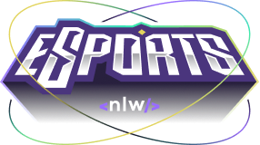

<h1 align="center">
    
</h1>

    

Aplicação focada em unir jogadores de diversos jogos. Você pode usá-lo para encontrar um duo ou até mesmo um squad completo para jogar o seu game favorito. Desenvolvido durante o evento NLW eSports realizado pela @Rocketseat. O projeto conta com uma aplicação web feito em React, uma aplicação mobile feito em React Native e o Back End desenvolvido em Node.

## 🛠️ Construído com

Esse projeto foi desenvolvido com as seguintes tecnologias:

- [TypeScript](https://www.typescriptlang.org/)
- [ReactJS](https://reactjs.org)
- [tailwindcss](https://tailwindcss.com/)
- [Vite](https://vitejs.dev)
- [React Native](https://reactnative.dev/)
- [Expo](https://expo.dev/)
- [Node](https://nodejs.org/en/)
- [SQLite](https://www.sqlite.org/)
- [Prisma](https://www.prisma.io/)

### 📋 Pré-requisitos

Para clonar e rodar essa aplicação, será necessário o [Git](https://git-scm.com), o [Node.js](https://nodejs.org/en/) e o [Expo](https://expo.dev/) instalados no seu computador.

## 💻 Layout

O layout pode ser visualizado pelo Figma: https://www.figma.com/community/file/1150897317533332617

## 📄 Licença

Este projeto está sob a licença MIT - veja o arquivo [LICENSE.md](LICENSE.md) para mais detalhes.

---
⌨️ com ❤️ por [Guilherme Spati](https://github.com/guispati) 😊